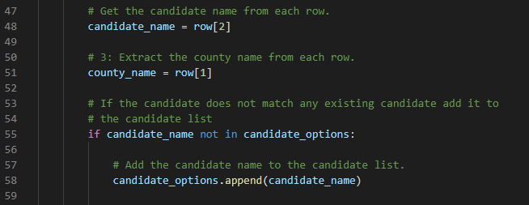
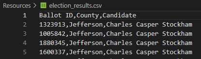
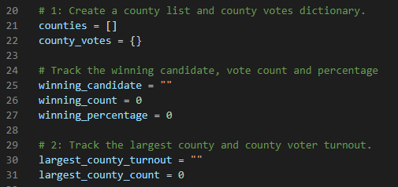
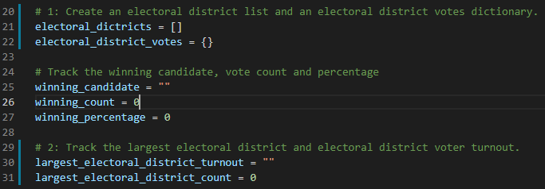

# Election_Analysis

## Project Overview 
A Colorado Board of Elections employee has given you the following tasks to complete the election audit of a recent congressional election.

1. Calculate the total number of votes cast.
2. Get a complete list of candidates who received votes.
3. Get a complete list of counties where votes were cast.
4. Calculate the total number of votes each candidate received.
5. Calculate the total number of votes cast in each county.
6. Calculate the percentage of votes each candidate won.
7. Calculate the percentage of votes cast in each county.
8. Determine the winner of the election based on popluar vote.
9. Determine the county with the highest number of votes cast.

Furthermore, a request has been made to provide an analysis of the script used to conduct this election audit to determine if it can be used to conduct audits of other elections. 

## Resources
- Data Source: election_results.csv
- Software: Python 3.8.8, Visual Studio Code 1.62.0

## Summary of Election Audit Results
The analysis of the election show that:
 - There were 369,711 votes cast in the election.
 - The counties where votes were cast were:
    - Jefferson
    - Denver
    - Arapahoe
 - The county results were:
    - Jefferson received 10.5% of the vote and 38,855 number of votes.
    - Denver recevied 82.8% of the vote and 306,055 number of votes.
    - Arapahoe received 6.7% of the vote and 24,801 number of votes.
 - The county with the number of votes cast was:
    - Denver. which received 82.8% of the vote and 306,055 number of votes.
 - The candidates were:
    - Charles Casper Stockham
    - Diana DeGette
    - Raymon Anthony Doane
 - The candidate results were:
    - Charles Casper Stockman received 23.0% of the vote and 85,213 number of votes.
    - Diana DeGette received 73.8% of the votes and 272,892 number of votes.
    - Raymon Anthony Doane recived 3.1% of the votes and 11,606 number of votes.
 - The winner of the election was:
    - Diana DeGette, who received 73.8% of the votes and 272,892 number of votes.

## Summary of Election Audit Analysis
The script used for this election audit can easily be used for other elections whether they are other Colorado congressional elections or not . The primary reason for this is that none of the variables, such as candidate name, are hardcoded into the script. Rather they are populated directly from the source document. An example of this is below.

Here in line 48 the candidate name is being extracted from the third column of the source file and rows 55-58 save that name to the list of candidate options if it does not already exist there. That means that all the subsequent calculations in the script for candiate vote counts and percentages will work regardless of who or how many candidates are in the source file. The same is true for the code relating to the counties. This gives the script the flexibility to work for any type of election as long as the source file is formatted in the same fashion as the elections_results.csv that was the source file for this election audit.

To make the code more applicable to all potential elections some minor changes are recommended for ease of understanding in both the code and the format of the output. Firstly, as other elections may not be conducted on a county basis all variable, list and dictionary names referencing "county" should be updated to the more generic "electoral district". This will mean that anyone from any level of government using this code for election audit will understand the code more clearly. An example of what this would look like is below with a section of the original code and the proposed modified code. 

Secondly, to compliment the changes to the code noted above the formatting of the output, both to the terminal and the test file, should also be updated to reflect the move away from the specific term "county" to the more general "electoral district". This would need to be done at both lines 88 and 113 with an example of one of these below as demonstration. 
